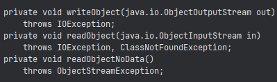

1. todo entry class (with attributes)

[ ] todo types 

```java
import java.util.Date;
// for getting time and converting date
import java.util.Calendar;

class TodoEntry {
    String name;
    String section;
    String subject;
    String professor;
    // String school
    int status;
    Date dlDay;
    Time dlTime;
}
```

2. priority algorithm.
heaps na naka base sa date and time ng dl.

3. serialize todos


